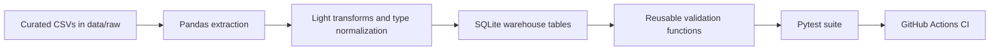

# Data Pipeline Testing and Validation Framework

[](https://github.com/tmushd/automated-data-validation-pipeline/actions/workflows/ci.yml)

A recruiter-friendly, end-to-end data quality project that turns a multi-table e-commerce dataset into a tested SQLite pipeline with automated validation in CI.

## Why This Project Stands Out

Most student data projects stop at analysis notebooks. This one is built like a small production-facing data workflow:

- multi-table relational data instead of a single flat CSV
- reusable validation functions instead of one-off assertions
- 89 automated Pytest checks covering schema, integrity, and business rules
- deterministic CI that reruns the pipeline and validation suite on every push and pull request
- a bad-data demo that proves the framework catches real failures

## At A Glance

| Area | What this project does |
| --- | --- |
| Dataset | Curated subset of the Olist Brazilian e-commerce dataset |
| Pipeline | CSV -> Pandas -> SQLite |
| Tables | `customers`, `orders`, `order_items`, `products` |
| Testing | 89 Pytest checks with reusable validators |
| Validation scope | schema, nulls, duplicates, FKs, dtypes, dates, business rules |
| CI | GitHub Actions on every push and PR |
| Failure demo | Intentional bad data in `data/bad/` |

## What It Does

This project simulates a lightweight analytics pipeline with a strong testing layer:

- extracts curated Olist CSV files from `data/raw/`
- applies light cleaning and type normalization in Pandas
- loads four related tables into SQLite
- validates the data with reusable validator functions in `src/validation/validators.py`
- runs the full pipeline and test suite automatically through GitHub Actions

## Tech Stack

- Python
- Pandas
- Pytest
- SQLite
- GitHub Actions

## Dataset

The repository uses a curated subset of the Olist Brazilian E-Commerce Public Dataset from Kaggle. The original dataset contains roughly 100k Brazilian e-commerce orders from 2016 to 2018 across multiple related marketplace tables.

To keep the repo lightweight and CI-friendly, this project commits a deterministic subset of four tables:

- `customers`
- `orders`
- `order_items`
- `products`

Committed subset sizes:

- `customers`: 3,000 rows
- `orders`: 3,000 rows
- `order_items`: 10,171 rows
- `products`: 3,309 rows

Note: in this Olist slice, `customer_id` is effectively order-scoped, so preserving referential integrity for 3,000 orders also means keeping 3,000 customer rows.

## Architecture



Additional docs:

- [Architecture Notes](./docs/architecture.md)
- [Portfolio Evidence](./docs/portfolio-evidence.md)

## Validation Coverage

The framework includes reusable checks for:

- table existence
- schema and column order
- not-null enforcement
- uniqueness and composite uniqueness
- non-negative numeric fields
- allowed categorical values
- dtype-family validation
- foreign-key validation
- date ordering rules
- blank-string detection
- minimum row-count thresholds

## Example Quality Rules

A few representative rules enforced by the suite:

- `orders.customer_id` must exist in `customers.customer_id`
- `order_items.product_id` must exist in `products.product_id`
- `order_status` must be in the allowed status set
- `price >= 0` and `freight_value >= 0`
- `order_approved_at >= order_purchase_timestamp` when present
- `(order_id, order_item_id)` must be unique in `order_items`

## Project Structure

```text
.
├── data/
│   ├── raw/
│   ├── bad/
│   └── processed/
├── database/
├── docs/
├── src/
│   ├── pipeline/
│   ├── validation/
│   └── utils/
├── tests/
└── .github/workflows/
```

## How To Run

Install dependencies:

```bash
pip install -r requirements.txt
```

Run the pipeline:

```bash
python -m src.pipeline.run_pipeline
```

Run the validation suite:

```bash
pytest -v
```

Run the standalone validation summary:

```bash
python -m src.validation.validation_runner
```

## Bad Data Demo

The `data/bad/` folder contains intentionally corrupted copies of the same tables, including:

- null primary-key values
- duplicate IDs and composite keys
- orphan foreign keys
- invalid `order_status` values
- negative numeric values
- invalid date ordering
- schema mismatch from a removed column

To reproduce a failing run against the corrupted dataset:

```bash
PIPELINE_RAW_DIR=data/bad pytest -v
```

Captured example outputs:

- [Clean pipeline output](./docs/sample-output/pipeline_clean.txt)
- [Clean pytest output](./docs/sample-output/pytest_clean.txt)
- [Bad data failure output](./docs/sample-output/pytest_bad_data.txt)

## CI

GitHub Actions runs the full workflow on every push and pull request:

1. checks out the repository
2. sets up Python 3.12 with pip caching
3. installs dependencies from `requirements.txt`
4. runs `python -m src.pipeline.run_pipeline`
5. runs `pytest -v`

## Interview Summary

A concise way to describe the project:

> I used a multi-table subset of the Olist Kaggle e-commerce dataset to build a realistic pipeline instead of validating a single flat CSV. I ingested the data with Pandas, loaded it into SQLite, built reusable validation functions, and exercised them through parameterized Pytest checks for schema, nulls, duplicates, foreign keys, data types, and business rules. I then integrated GitHub Actions so every push and pull request reruns the pipeline and test suite automatically.

## Resume Version

**Data Pipeline Testing and Validation Framework | Python, Pandas, Pytest, SQLite, GitHub Actions**

- Built a reusable validation framework for a multi-table e-commerce pipeline using Pandas and SQLite, implementing 40+ parameterized Pytest checks for schema enforcement, null detection, duplicate detection, referential integrity, and business-rule validation
- Integrated a GitHub Actions CI pipeline to run automated data quality tests on every push and pull request, making validation reproducible across code changes
