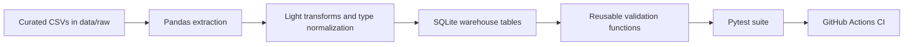

# Data Pipeline Testing and Validation Framework

[](https://github.com/tmushd/automated-data-validation-pipeline/actions/workflows/ci.yml)

Built a reusable data validation framework for a multi-table e-commerce pipeline using Pandas and SQLite. The project ingests a curated subset of the Olist Brazilian e-commerce dataset, applies light transformations, loads four related tables into SQLite, and runs 89 automated Pytest checks for schema, nulls, duplicates, referential integrity, data types, and business rules.

## Project Summary

This project simulates a lightweight analytics pipeline with a strong testing layer:

- Source layer: curated Olist CSV subset committed in `data/raw/`
- Staging layer: cleaned Pandas DataFrames
- Warehouse layer: SQLite tables in `database/pipeline.db`
- Quality layer: reusable validators in `src/validation/validators.py`
- CI layer: GitHub Actions on every push and pull request

## Tech Stack

- Python
- Pandas
- Pytest
- SQLite
- GitHub Actions

## Dataset

The repository uses a curated subset of the Olist Brazilian E-Commerce Public Dataset from Kaggle. The original dataset covers roughly 100k orders from 2016 to 2018 across multiple related marketplace tables. To keep the repository lightweight and CI-friendly, this repo commits only a deterministic subset of four tables:

- `customers`
- `orders`
- `order_items`
- `products`

Committed subset sizes:

- `customers`: 3,000 rows
- `orders`: 3,000 rows
- `order_items`: 10,171 rows
- `products`: 3,309 rows

Note: in Olist, `customer_id` is effectively order-scoped in this slice of the data, so preserving relational integrity for 3,000 orders also means keeping 3,000 customer rows.

## Architecture



## Repository Layout

```text
.
├── data/
│   ├── raw/
│   ├── bad/
│   └── processed/
├── database/
├── src/
│   ├── pipeline/
│   ├── validation/
│   └── utils/
├── tests/
└── .github/workflows/
```

## Validation Coverage

The framework includes reusable validators for:

- table existence
- schema and column order checks
- not-null enforcement
- uniqueness and composite uniqueness
- negative numeric detection
- allowed categorical values
- dtype-family validation
- foreign-key validation
- date ordering rules
- blank-string detection
- minimum row-count thresholds

The current suite contains 89 automated checks, including dedicated bad-data detection tests.

## How To Run

Install dependencies:

```bash
pip install -r requirements.txt
```

Run the pipeline:

```bash
python -m src.pipeline.run_pipeline
```

Run the validation suite:

```bash
pytest -v
```

Run the standalone validation summary:

```bash
python -m src.validation.validation_runner
```

## Bad Data Demo

The `data/bad/` folder contains intentionally corrupted copies of the same tables, including:

- null primary-key values
- duplicate IDs and composite keys
- orphan foreign keys
- invalid `order_status` values
- negative numeric values
- invalid date ordering
- schema mismatch from a removed column

To reproduce a failing pipeline/test run against the corrupted dataset, point the pipeline at `data/bad/`:

```bash
PIPELINE_RAW_DIR=data/bad pytest -v
```

The repository also includes `tests/test_bad_data_detection.py`, which proves the validators catch these failures without breaking the default green CI run.

## CI

GitHub Actions runs the full workflow on every push and pull request:

1. checks out the repository
2. sets up Python 3.12 with pip caching
3. installs dependencies from `requirements.txt`
4. runs `python -m src.pipeline.run_pipeline`
5. runs `pytest -v`

## Interview Positioning

A concise way to describe the project:

> I used a multi-table subset of the Olist Kaggle e-commerce dataset to build a realistic pipeline instead of validating a single flat CSV. I ingested the data with Pandas, loaded it into SQLite, built reusable validation functions, and exercised them through parameterized Pytest checks for schema, nulls, duplicates, foreign keys, data types, and business rules. I then integrated GitHub Actions so every push and pull request reruns the pipeline and test suite automatically.

## Resume Bullet

**Data Pipeline Testing and Validation Framework | Python, Pandas, Pytest, SQLite, GitHub Actions**

- Built a reusable validation framework for a multi-table e-commerce pipeline using Pandas and SQLite, implementing 40+ parameterized Pytest checks for schema enforcement, null detection, duplicate detection, referential integrity, and business-rule validation
- Integrated a GitHub Actions CI pipeline to run automated data quality tests on every push and pull request, making validation reproducible across code changes
