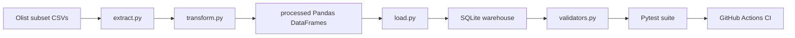

# Architecture Notes

## Flow

## Design Choices

- The repository commits a curated subset instead of downloading Kaggle data in CI.
- SQLite keeps the warehouse layer simple and reproducible for local development and GitHub Actions.
- Validators return structured dictionaries so the framework can support pytest assertions and standalone reporting.
- `data/bad/` demonstrates hard failures such as duplicate keys, orphan references, invalid statuses, and schema mismatches.
